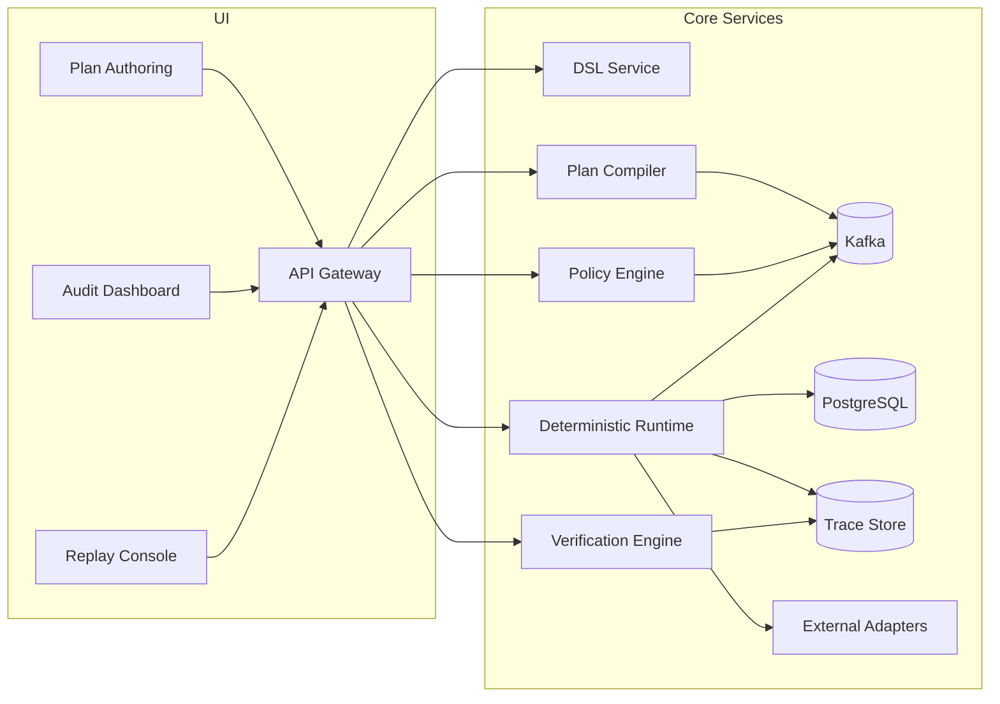

# Executive Summary

Building a **Deterministic Execution Layer for AI (DEL-AI)** addresses the critical gap between probabilistic AI reasoning and the deterministic demands of enterprise systems. In enterprise settings (banking, healthcare, etc.), **compliance, reliability, and auditability** are paramount. AI agents often fail at scale because each run is non-deterministic and untraceable, making debugging and compliance difficult. DEL-AI introduces a *compiler + runtime* that converts AI-generated plans into **strictly typed, policy-checked execution workflows**. By enforcing schemas, policies, and traceability at every step, DEL-AI aims to guarantee repeatable execution for the same input context.

## Key Highlights

- **Enterprise requirements:** functional and non-functional requirements including compliance targets (GDPR, HIPAA, SOC2, SOX), security controls (RBAC, encryption, OWASP), and observability.
- **System architecture:** modular components for DSL parsing, plan compilation, policy enforcement, deterministic runtime execution, verification, adapter integration, and replay.
- **Java module design:** Spring Boot microservices with clear package boundaries (`dsl`, `compiler`, `policy`, `runtime`, `verifier`, `adapters`).
- **Scalability & reliability:** event-driven architecture (Kafka), autoscaling on Kubernetes, HA goals (>=99.9% uptime), and event sourcing/replay.
- **Observability & compliance:** OpenTelemetry tracing, centralized logs, immutable audit records, and explainability support for regulated environments.
- **Delivery enablement:** prompt templates for generating code, tests, infra, and CI/CD assets.

---

# 1. Enterprise Requirements

## 1.1 Functional Requirements

- Execution DSL definition for typed, machine-readable plans.
- Plan compiler to build executable graphs and validate schema constraints.
- Policy and compliance engine for runtime and pre-runtime checks.
- Deterministic runtime with retries, state management, and resumability.
- Verification and replay for divergence detection and consistency checks.
- External system adapters with typed interfaces and audit hooks.
- Audit/explainability services for traceability and regulator review.
- Web UI (React/TypeScript) for authoring, monitoring, auditing, replay.
- REST/gRPC APIs for plan, execution, verification, and admin operations.
- Multi-tenancy and RBAC for tenant isolation and access governance.
- Versioning and rollback support for plans and policies.

## 1.2 Non-Functional Requirements

- **Scalability:** thousands of concurrent tasks; 5,000-10,000 steps/sec target.
- **Latency:** sub-500ms per action (excluding external API latency).
- **Availability:** 99.9%+ uptime and multi-AZ deployment.
- **Consistency:** strong integrity guarantees for stateful/financial operations.
- **Resilience:** retries, circuit breakers, fault isolation.
- **Security:** encryption in transit/at rest, OAuth2/JWT, SSO, secret management.
- **Compliance:** GDPR, HIPAA, SOC2 Type II, SOX-aligned controls.
- **Observability:** tracing, metrics, logs, alerting.
- **Deployability:** Docker + Kubernetes + IaC + CI/CD.
- **Extensibility:** plugin adapters and policy-as-code model.

## 1.3 Security & Compliance Requirements

- GDPR: consent, minimization, access/deletion rights, processing logs.
- HIPAA: PHI controls, auditability, incident response readiness.
- SOC2 Type II: security, availability, processing integrity, confidentiality, privacy.
- SOX: immutable financial audit trails and segregation of duties.
- Security frameworks: NIST, OWASP API Security, CIS Kubernetes Benchmarks.

---

# 2. System Architecture

## Core Components

1. **Execution DSL** (`com.company.agent.dsl`)
2. **Plan Compiler** (`com.company.agent.compiler`)
3. **Policy Engine** (`com.company.agent.policy`)
4. **Deterministic Runtime** (`com.company.agent.runtime`)
5. **Verification Engine** (`com.company.agent.verifier`)
6. **Adapters** (`com.company.agent.adapters`)
7. **Schema Registry**
8. **Trace Store**
9. **Replay Engine**

---

# 3. Technical Stack

- **Backend:** Java 17+, Spring Boot, Spring Security, Spring Data.
- **Frontend:** React + TypeScript.
- **Data:** PostgreSQL + Elasticsearch/OpenSearch (+ optional Redis).
- **Messaging:** Kafka + Schema Registry.
- **Security:** OAuth2/OIDC, JWT, KMS, TLS, secrets manager.
- **Platform:** Docker, Kubernetes (EKS), Terraform, Helm.
- **Observability:** OpenTelemetry, Jaeger, Prometheus, Grafana, ELK/EFK.
- **CI/CD:** GitHub Actions.

---

# 4. API Surface (Representative)

- `POST /api/v1/plans/parse`
- `POST /api/v1/plans/{planId}/compile`
- `POST /api/v1/executions`
- `GET /api/v1/executions/{executionId}`
- `GET /api/v1/executions/{executionId}/verify`
- `POST /api/v1/executions/{executionId}/replay`
- `GET/POST /api/v1/policies`

All endpoints require bearer authentication and role/scoped access.

---

# 5. Data Model (Representative)

- `plans`
- `plan_steps`
- `compiled_plans`
- `executions`
- `execution_steps`
- `policies`
- `verifications`

High-volume traces/events are streamed and indexed separately.

---

# 6. Delivery Roadmap (Phased)

1. **Phase 1 (Core):** DSL, compiler, runtime, basic policy and logging.
2. **Phase 2 (Security/Scale):** hardening, HA, adapters, policy expansion.
3. **Phase 3 (UX/DevEx):** plan editor, audit/replay UIs, CI/CD, IaC.
4. **Phase 4 (Enterprise readiness):** SOC2/GDPR/HIPAA controls, performance tuning, beta launch.

---

# 7. Appendix: Code Generation Prompt Areas

- Spring Boot services/controllers/entities.
- Flyway migrations.
- Kafka producers/consumers.
- OpenTelemetry instrumentation.
- Helm + Terraform infrastructure.
- React UI components and Redux slices.
- JUnit, integration, and Cypress tests.
- GitHub Actions pipeline and OpenAPI SDK generation.

---

# Conclusion

DEL-AI provides a deterministic control plane that transforms AI-generated intent into governed, auditable, and repeatable execution. This architecture enables enterprise adoption in regulated domains by enforcing typed plans, policy checks, runtime determinism, and complete traceability across the full lifecycle.
